# Tuitris System Architecture

**Type:** Architecture Diagram
**Last Updated:** 2025-11-28
**Related Files:**
- `src/index.tsx`
- `src/components/Game.tsx`
- `src/game/gameState.ts`
- `src/game/board.ts`
- `src/game/pieces.ts`
- `src/highscore/highscore.ts`
- `src/components/Confetti.tsx`

## Purpose

Shows how Tuitris delivers instant, responsive gameplay in the terminal by efficiently managing game state, rendering updates, and persisting achievements.

## Diagram

```mermaid
graph TD
    subgraph "Front-Stage: Player Experience"
        UI[Terminal Interface<br/>📊 IMPACT: Instant visual feedback<br/>colorful blocks, smooth animations]
        Controls[Keyboard Controls<br/>📊 IMPACT: Responsive control<br/>arrow keys, spacebar, pause]
        Feedback[Score & Progress Display<br/>📊 IMPACT: Achievement tracking<br/>score, level, lines cleared]
    end

    subgraph "Back-Stage: Game Engine"
        App[React/Ink App<br/>src/index.tsx]
        GameComp[Game Component<br/>src/components/Game.tsx<br/>🔧 Coordinates all features]

        subgraph "Core Game Logic"
            GameState[Game State Manager<br/>src/game/gameState.ts<br/>🔧 Pure functions for moves]
            Board[Board Manager<br/>src/game/board.ts<br/>🔧 Collision detection]
            Pieces[Piece Manager<br/>src/game/pieces.ts<br/>🔧 7 tetromino types]
        end

        subgraph "UI Rendering"
            BoardComp[Board Component<br/>src/components/Board.tsx<br/>🔧 Renders 20x10 grid + ghost piece]
            SidebarComp[Sidebar Component<br/>src/components/Sidebar.tsx<br/>🔧 Shows stats]
            GameOverComp[GameOver Component<br/>src/components/GameOver.tsx<br/>🔧 Score submission]
            ConfettiComp[Confetti Component<br/>src/components/Confetti.tsx<br/>🔧 Tetris celebration animation]
        end

        HighScore[HighScore System<br/>src/highscore/highscore.ts<br/>🔧 JSON persistence]
    end

    subgraph "External Storage"
        HSFile[highscore.json<br/>📊 IMPACT: Leaderboard persistence<br/>top 10 scores saved]
    end

    Controls -->|Player input| GameComp
    GameComp -->|State updates| GameState
    GameState -->|Validates moves| Board
    GameState -->|Spawns pieces| Pieces
    GameComp -->|Renders| BoardComp
    GameComp -->|Renders| SidebarComp
    GameComp -->|Renders on game end| GameOverComp
    GameComp -->|Renders on Tetris| ConfettiComp
    BoardComp -->|Displays| UI
    SidebarComp -->|Displays| Feedback
    GameOverComp -->|Save score| HighScore
    HighScore -->|Persists| HSFile
    UI -.->|Visual feedback| Controls
    Feedback -.->|Motivates| Controls
```

## Key Insights

- **Instant responsiveness**: Pure function game state management enables predictable 60fps updates without lag
- **Achievement persistence**: JSON-based high scores survive across sessions, motivating replay
- **Progressive difficulty**: Level increases every 10 lines, speeding up gameplay from 1s to 100ms drop time
- **Error prevention**: Wall-kick rotation system prevents frustrating failed rotations near edges
- **Visual clarity**: Colored tetromino rendering makes piece identification instant
- **Ghost piece preview**: Semi-transparent landing preview helps players plan drops
- **Tetris celebration**: Confetti animation rewards 4-line clears with visual feedback

## Technical Enablers

- React/Ink: Terminal UI framework enabling component-based rendering
- Pure functions: Immutable state updates prevent bugs and enable predictable gameplay
- useEffect hooks: Automatic gravity via interval-based piece dropping
- Collision detection: Board validation prevents invalid moves before state updates
- File system persistence: High scores saved to JSON without database dependency

## Change History

- **2025-11-28:** Added Confetti component, ghost piece preview, Tetris celebration
- **2025-11-07:** Initial architecture diagram created
