# Gameplay User Journey

**Type:** Sequence Diagram
**Last Updated:** 2025-11-07
**Related Files:**
- `src/components/Game.tsx`
- `src/game/gameState.ts`
- `src/game/board.ts`

## Purpose

Shows complete player interaction flow from game start through piece control to game over, highlighting responsiveness and feedback mechanisms that create engaging gameplay.

## Diagram

```mermaid
sequenceDiagram
    actor Player
    participant Terminal as Terminal UI<br/>📊 Visual Feedback
    participant Game as Game Component<br/>🔧 Input Handler
    participant State as Game State<br/>🔧 Logic Engine
    participant Board as Board Manager<br/>🔧 Validator

    Note over Player,Board: Game Start 🎮
    Player->>Terminal: Launch tuitris
    Terminal->>Game: Initialize
    Game->>State: createInitialState()
    State-->>Game: Empty board + first piece
    Game->>Terminal: Render board
    Terminal-->>Player: Show colorful tetris grid<br/>📊 IMPACT: Instant visual understanding

    Note over Player,Board: Active Gameplay Loop 🎯
    loop Every 1000ms - (level*100ms)
        Game->>State: Auto moveDown()
        State->>Board: Validate position
        Board-->>State: Valid/Invalid
        State-->>Game: Updated position
        Game->>Terminal: Re-render
        Terminal-->>Player: Smooth piece falling<br/>📊 IMPACT: Visible progress
    end

    Note over Player,Board: Player Controls Piece ⌨️
    Player->>Terminal: Press LEFT arrow
    Terminal->>Game: Handle input
    Game->>State: moveLeft()
    State->>Board: isValidPosition()
    Board-->>State: Valid ✓
    State-->>Game: Updated position
    Game->>Terminal: Re-render
    Terminal-->>Player: Piece moves left instantly<br/>📊 IMPACT: <50ms response time

    Player->>Terminal: Press UP arrow (rotate)
    Terminal->>Game: Handle input
    Game->>State: rotate()
    State->>Board: Try rotation
    alt Rotation valid
        Board-->>State: Valid ✓
        State-->>Game: New rotation
    else Wall collision
        State->>Board: Try wall kicks (±1, ±2)
        Board-->>State: Kick position found
        State-->>Game: Rotated + nudged position
    else No valid kick
        State-->>Game: No change
    end
    Game->>Terminal: Re-render
    Terminal-->>Player: Rotation feedback<br/>📊 IMPACT: Prevents frustration

    Player->>Terminal: Press SPACEBAR (hard drop)
    Terminal->>Game: Handle input
    Game->>State: hardDrop()
    loop Until collision
        State->>Board: Check y+1 position
        Board-->>State: Valid/Invalid
    end
    Note over State: Calculate drop distance × 2 points
    State->>Board: Lock piece to board
    Board-->>State: Updated board
    State->>Board: clearLines()
    alt Lines cleared (1-4)
        Board-->>State: Lines removed + count
        Note over State: Score: [100,300,500,800] × level<br/>📊 IMPACT: Reward skill combos
        State->>State: Check level up (every 10 lines)
        alt Level increased
            Note over State: Increase speed by 100ms<br/>📊 IMPACT: Progressive challenge
        end
    end
    State->>State: Spawn next piece
    State->>Board: Check game over (top row filled)
    alt Game continues
        State-->>Game: New piece spawned
        Game->>Terminal: Re-render
        Terminal-->>Player: New piece + updated score<br/>📊 IMPACT: Continuous engagement
    else Game over
        State-->>Game: gameOver: true
        Game->>Terminal: Show GameOver screen
        Terminal-->>Player: Final score + high scores<br/>📊 IMPACT: Achievement recognition
    end

    Note over Player,Board: Game Over Flow 🏆
    Player->>Terminal: Enter name
    Terminal->>Game: Submit score
    Game->>Game: saveHighScore()
    Game-->>Terminal: Updated leaderboard
    Terminal-->>Player: Show ranking<br/>📊 IMPACT: Competitive motivation
    Player->>Terminal: Press R (restart)
    Terminal->>Game: Reset
    Game->>State: createInitialState()
    State-->>Game: Fresh game
    Game->>Terminal: Re-render
    Terminal-->>Player: New game ready<br/>📊 IMPACT: Instant replay

    Note over Player,Board: Pause/Resume ⏸️
    Player->>Terminal: Press P
    Terminal->>Game: Handle input
    Game->>State: togglePause()
    State-->>Game: paused: true
    Game->>Terminal: Show PAUSED overlay
    Terminal-->>Player: Gameplay frozen<br/>📊 IMPACT: Player control over timing
```

## Key Insights

- **Sub-50ms responsiveness**: Immediate visual feedback for all player inputs prevents perceived lag
- **Progressive difficulty**: Automatic speed increase every 10 lines keeps players challenged
- **Intelligent rotation**: Wall-kick system tries 4 alternative positions, reducing frustration from edge rotations
- **Combo scoring**: 4-line clear (Tetris) awards 800pts × level, rewarding skillful play
- **Zero-friction restart**: Single key press resets game, encouraging repeated play sessions
- **Competitive persistence**: Top 10 leaderboard saves across sessions, providing long-term goals

## Technical Enablers

- useInput hook: React/Ink keyboard event handling with zero polling overhead
- useEffect timer: Automatic gravity via setInterval cleared on pause/gameover
- Pure state functions: Predictable updates enable confident rollback on invalid moves
- Immutable board: Copy-on-write prevents visual glitches from state mutations
- JSON persistence: File-based high scores require no database setup

## Change History

- **2025-11-07:** Initial gameplay journey diagram created
